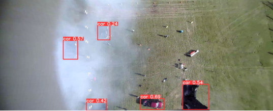
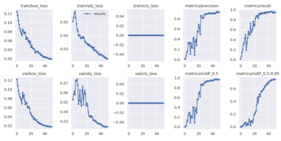
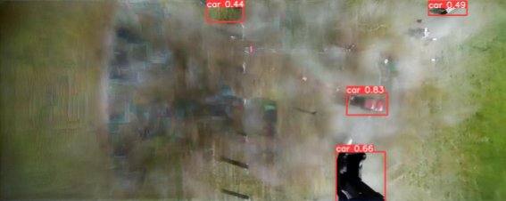
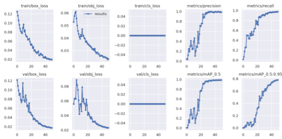
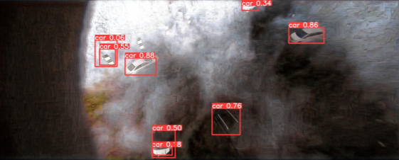

# 5th-UG2-challenge

Please read [the report](/report.pdf) available in the home folder of this repository for a better explanation regarding this project.

## Object Detection
- [yolo_v5](https://github.com/gabriele-tombesi96/5th-UG2-challenge/tree/main/obj_detection/yolov5) is the chosen model for object detection
- Created custom fine-tuning dataset based on the training and dry-run set collected from the A2I2 dataset
  - Pre-processing step of the label files in order to comply with the bounding boxes coordinates format expected by the network
  - Created a custom configuration file for the dataset, in order to set the correct paths to the folders containing images and labels
-  Enabled the W&B flow for real time visualization and cloud logging, in order to be able to have a better overview of the QoR of each fine-tuning attempt.
-  Several fine-tuning attempts playing with some of the hyperparameters leveraged by yolo_v5. Optimal choice:
   -  50 epochs
   -  batch_size=32

Training results summary

Example of object detection on test images

## Image Dehazing
Models used:
   - [FFA-Net](/image_dehazing/FFA-Net/)
   - [DWGAN](/image_dehazing/DWGAN/)
   - [AECR-Net](/image_dehazing/AECRNET_output/)

### FFA-NEt
    - Perform fine-tuning on our dataset 
    - Inference with the updated model on both our training and test images
      - Results slightly improved when inference is run recursively on previous results
    - Experiment with one-cycle of FFA-net prediction vs multiple runs recursively.
      - Slight increase in performance of the downstream yolov5 finetuning.
Summary of results 
Example 

### DWGAN

Drawbacks:
    - Preprocess our training and testing images by applying both resizing and padding to obtain 1600x1200 sized images that are required by the model
    - No finetuning API

Still offering promising results in the documentation provided by the creators, which is why we used it to augment our dataset with multiple inference experiments

    - Perform a single DWGAN inference pass on both the training and testing images
      - Use training images for finetuning yolov5
      - Use test images final yolov5 inference pass

 Summary 
 Example 

### AECR-Net 
    - Run inference on our training and test data
    - Passed the dehazed training images to the finetuning of YOLO
    - Perform inference with the fine tuned yolo model on the dehazed test images
 Summary 
 Example 

## Augmented Dataset Experiments
Please check report for details.
